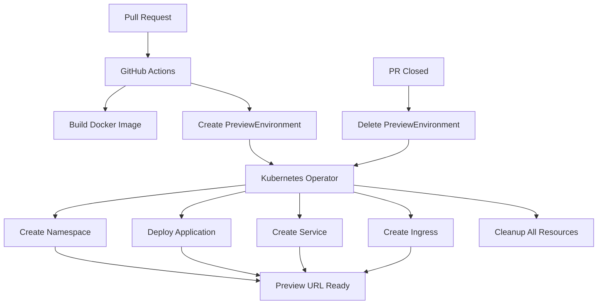

# PreviewEnvironment Feature Documentation

This document provides comprehensive information about the HomeCare PreviewEnvironment feature that automatically deploys preview environments for pull requests.

## Table of Contents

- [Overview](#overview)
- [Architecture](#architecture)
- [Components](#components)
- [Setup and Installation](#setup-and-installation)
- [Usage](#usage)
- [Configuration](#configuration)
- [Troubleshooting](#troubleshooting)
- [Development](#development)

## Overview

The PreviewEnvironment feature provides automatic preview environments for every pull request, enabling developers to test changes in isolated environments before merging. Each preview environment gets:

- **Unique URL**: `<username><pr><commit>.dev.homecareapp.xyz`
- **Isolated Namespace**: `preview<username>-pr<number>`
- **Automatic Cleanup**: TTL-based or PR closure cleanup
- **Complete Resource Management**: All resources managed by the operator

## Architecture

### High-Level Flow



### Components Interaction

1. **GitHub Actions** builds images and manages PreviewEnvironment resources
2. **Kubernetes Operator** watches PreviewEnvironment resources and manages infrastructure
3. **NGINX Ingress** provides routing to preview environments
4. **Owner References** ensure automatic cleanup when PreviewEnvironment is deleted

## Components

### 1. Custom Resource Definition (CRD)

**File**: `operator/config/crd/previewenvironments.yaml`

The PreviewEnvironment CRD defines the schema for preview environment resources:

```yaml
apiVersion: preview.homecareapp.xyz/v1
kind: PreviewEnvironment
metadata:
  name: preview-user-pr123
spec:
  repoName: "homecare-demo/homecare"
  prNumber: 123
  branch: "feature/new-feature"
  commitSha: "abc1234567"
  githubUsername: "username"
  imageTag: "ghcr.io/homecare-demo/homecare:preview..."
  ttl: 72  # hours
status:
  phase: "Ready"
  environmentUrl: "user123abc1234.dev.homecareapp.xyz"
  namespace: "previewuser-pr123"
  createdAt: "2024-01-01T12:00:00Z"
  expiresAt: "2024-01-04T12:00:00Z"
```

**Key Features**:
- Validation for all required fields
- Status tracking with phases: Pending, Creating, Ready, Failed, Terminating
- TTL support for automatic expiration
- Rich metadata for identification and management

### 2. Kubernetes Operator

**Location**: `operator/`

The Go-based operator built with controller-runtime provides:

#### Core Functionality
- **Resource Watching**: Monitors PreviewEnvironment resources
- **Namespace Management**: Creates isolated namespaces per preview
- **Resource Deployment**: Manages deployment, service, and ingress
- **Owner References**: Sets PreviewEnvironment as owner of all created resources
- **TTL Handling**: Automatic cleanup based on expiration time
- **URL Generation**: Creates unique URLs for each preview

#### Resource Management
```go
// Namespace: preview<username>-pr<number>
namespaceName := fmt.Sprintf("preview%s-pr%d", username, prNumber)

// URL: <username><pr><commit>.dev.homecareapp.xyz
url := fmt.Sprintf("%s%d%s.dev.homecareapp.xyz", username, prNumber, shortCommit)
```

#### Owner References
All created resources have owner references to the PreviewEnvironment:
- Namespace
- Deployment  
- Service
- Ingress

This ensures cascading deletion when the PreviewEnvironment is removed.

### 3. GitHub Actions Workflow

**File**: `.github/workflows/preview.yml`

#### Triggers
- **Pull Request Events**: opened, synchronize, reopened, closed
- **Manual Dispatch**: For manual deployment/cleanup

#### Jobs

##### Build Job
- Builds branch-specific Docker images
- Tags: `preview<username>-pr<number><commit>`
- Pushes to GitHub Container Registry
- Supports multi-platform builds (ARM64 for AKS)

##### Deploy Job
- Uses `preview` GitHub environment
- Authenticates with Azure via OIDC
- Creates PreviewEnvironment resource
- Waits for operator to provision resources
- Updates PR with deployment status and URL

##### Cleanup Job
- Triggers on PR closure
- Deletes PreviewEnvironment resource
- Operator handles cascading resource cleanup
- Updates PR with cleanup status

### 4. Deployment Script

**File**: `scripts/deploy-operator.sh`

Enhanced deployment script with:
- **Image Building**: Builds and pushes operator image
- **Environment Support**: dev/prod deployment modes
- **Prerequisite Checking**: Validates tools and cluster access
- **Complete Setup**: CRD, RBAC, and operator deployment
- **Verification**: Post-deployment validation

#### Usage Examples

```bash
# Deploy to dev environment (default)
./scripts/deploy-operator.sh

# Deploy to production with specific tag
./scripts/deploy-operator.sh -e prod -t v1.0.0

# Deploy without building new images
./scripts/deploy-operator.sh --no-build

# Force rebuild of images
./scripts/deploy-operator.sh --force-rebuild
```

## Setup and Installation

### Prerequisites

1. **Kubernetes Cluster**: AKS cluster with NGINX ingress controller
2. **Domain Configuration**: Wildcard DNS for `*.dev.homecareapp.xyz`
3. **GitHub Repository**: With proper secrets and environments configured
4. **Tools**: kubectl, docker, go (for development)

### Installation Steps

#### 1. Deploy the Operator

```bash
# Clone repository
git clone <repository-url>
cd homecare

# Deploy operator to dev environment
./scripts/deploy-operator.sh

# Or deploy to production
./scripts/deploy-operator.sh -e prod
```

#### 2. Verify Installation

```bash
# Check operator pod
kubectl get pods -n homecare-operator-system

# Check CRD installation
kubectl get crd previewenvironments.preview.homecareapp.xyz

# View operator logs
kubectl logs -f deployment/homecare-preview-operator-controller-manager \
  -n homecare-operator-system
```

#### 3. DNS Configuration

Configure your DNS provider to point `*.dev.homecareapp.xyz` to your NGINX ingress load balancer IP:

```bash
# Get ingress IP
kubectl get svc -n ingress-nginx ingress-nginx-controller

# Add DNS record (example for Cloudflare)
# *.dev.homecareapp.xyz -> A -> <LOAD_BALANCER_IP>
```

## Usage

### Automatic Preview Environments

1. **Create Pull Request**: Preview environment automatically deploys
2. **Review Changes**: Access via unique URL posted in PR comments
3. **Update PR**: New commits trigger updated deployments
4. **Close PR**: Resources automatically cleaned up

### Manual Operations

#### Deploy Specific PR

```bash
# Using GitHub Actions workflow dispatch
# Go to Actions -> Preview Environment -> Run workflow
# Select action: deploy, enter PR number
```

#### Create PreviewEnvironment Manually

```yaml
apiVersion: preview.homecareapp.xyz/v1
kind: PreviewEnvironment
metadata:
  name: manual-test
spec:
  repoName: "homecare-demo/homecare"
  prNumber: 999
  branch: "main"
  commitSha: "1234567890abcdef"
  githubUsername: "developer"
  imageTag: "ghcr.io/homecare-demo/homecare:latest"
  ttl: 24
```

```bash
kubectl apply -f preview-environment.yaml
```

#### Monitor Preview Environment

```bash
# List all preview environments
kubectl get previewenvironments

# Get detailed status
kubectl get previewenvironment <name> -o yaml

# Check created resources
kubectl get all -n preview<username>-pr<number>
```

#### Manual Cleanup

```bash
# Delete specific preview environment
kubectl delete previewenvironment <name>

# Cleanup will cascade to all associated resources
```

## Configuration

### Operator Configuration

The operator can be configured via environment variables:

| Variable | Description | Default |
|----------|-------------|---------|
| `WATCH_NAMESPACE` | Namespace to watch (empty = all) | `""` |
| `METRICS_ADDR` | Metrics server address | `:8080` |
| `PROBE_ADDR` | Health probe address | `:8081` |
| `LEADER_ELECT` | Enable leader election | `false` |

### Preview Environment Defaults

| Setting | Default | Range |
|---------|---------|-------|
| TTL | 24 hours | 1-168 hours |
| Resources | 25m CPU, 32Mi Memory | - |
| Replicas | 1 | - |

### GitHub Actions Configuration

Required secrets in GitHub repository:
- `AZURE_CLIENT_ID`
- `AZURE_TENANT_ID` 
- `AZURE_SUBSCRIPTION_ID`
- `AZURE_RESOURCE_GROUP`
- `AZURE_CLUSTER_NAME`

Environment: `preview` (configured in Terraform)

## Troubleshooting

### Common Issues

#### 1. PreviewEnvironment Stuck in Creating

```bash
# Check operator logs
kubectl logs -f deployment/homecare-preview-operator-controller-manager \
  -n homecare-operator-system

# Check events in target namespace
kubectl get events -n preview<username>-pr<number> --sort-by=.metadata.creationTimestamp
```

#### 2. Image Pull Errors

```bash
# Check if image exists
docker manifest inspect <image-tag>

# Verify image architecture matches cluster
kubectl describe pod <pod-name> -n preview<username>-pr<number>
```

#### 3. Ingress Not Working

```bash
# Check ingress controller
kubectl get pods -n ingress-nginx

# Verify ingress resource
kubectl get ingress -n preview<username>-pr<number>

# Check DNS resolution
nslookup <username><pr><commit>.dev.homecareapp.xyz
```

#### 4. GitHub Actions Failures

- **OIDC Authentication**: Verify federated identity credentials in Azure
- **Cluster Access**: Check AKS cluster status and permissions
- **Image Registry**: Ensure GITHUB_TOKEN has packages:write permission

### Debugging Commands

```bash
# Get operator status
kubectl get deployment homecare-preview-operator-controller-manager \
  -n homecare-operator-system

# View all preview environments
kubectl get previewenvironments -o wide

# Check resource creation
kubectl get all,ingress -n preview<username>-pr<number>

# View detailed PreviewEnvironment status
kubectl describe previewenvironment <name>

# Check operator events
kubectl get events -n homecare-operator-system \
  --sort-by=.metadata.creationTimestamp
```

## Development

### Building the Operator

```bash
cd operator

# Build binary
go build -o bin/manager cmd/main.go

# Build Docker image
docker build -t ghcr.io/mvkaran/homecare/homecare-preview-operator:dev .

# Run tests
make test

# Generate manifests
make manifests
```

### Local Development

```bash
# Run operator locally (requires kubeconfig)
cd operator
go run cmd/main.go

# Deploy local changes
./scripts/deploy-operator.sh -t dev --force-rebuild
```

### Adding Features

1. **Modify CRD**: Update `api/v1/previewenvironment_types.go`
2. **Update Controller**: Modify `internal/controller/previewenvironment_controller.go`
3. **Regenerate**: Run `make manifests generate`
4. **Test**: Deploy and verify functionality
5. **Update Documentation**: Keep docs current

### Testing

```bash
# Unit tests
cd operator
make test

# Integration tests (requires cluster)
make test-e2e

# Manual testing
kubectl apply -f - <<EOF
apiVersion: preview.homecareapp.xyz/v1
kind: PreviewEnvironment
metadata:
  name: test-preview
spec:
  repoName: "homecare-demo/homecare"
  prNumber: 999
  branch: "test"
  commitSha: "test123"
  githubUsername: "testuser"
  imageTag: "ghcr.io/homecare-demo/homecare:latest"
  ttl: 1
EOF
```

## Security Considerations

1. **RBAC**: Operator has minimal required permissions
2. **Isolation**: Each preview runs in isolated namespace
3. **Resource Limits**: Prevents resource exhaustion
4. **TTL**: Automatic cleanup prevents resource accumulation
5. **Image Security**: Uses distroless base images
6. **OIDC**: No long-lived secrets in GitHub Actions

## Cost Optimization

1. **Resource Limits**: Minimal CPU/memory requests
2. **TTL**: Automatic cleanup reduces costs
3. **Single Replica**: Cost-effective for previews
4. **ARM64**: Optimized for ARM64 AKS nodes
5. **Shared Ingress**: Single NGINX ingress for all previews

## Future Enhancements

1. **SSL/TLS**: Automatic certificate generation
2. **Scaling**: Multiple replicas for high availability
3. **Monitoring**: Prometheus metrics integration
4. **Webhooks**: Admission webhooks for validation
5. **Multi-Region**: Support for multiple clusters
6. **Database**: Preview-specific database instances